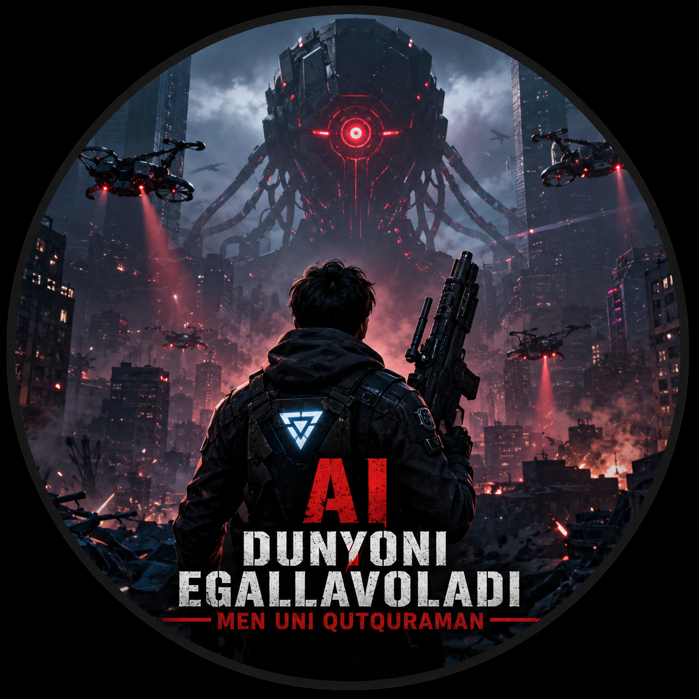

# Qutqaruvchi

**Qutqaruvchi** — Python va Ursina Engine yordamida yaratilgan 3D shooter o'yini.

## 📖 Hikoya

Sun'iy intellekt (AI) dunyoni egalladi.
Siz esa insoniyatning so'nggi umidisiz.

Qurollaringiz bilan AI qo'shinlariga qarshi kurashing, dushmanlarni yo'q qiling va insoniyatni qutqaring.

## ✨ Xususiyatlari

- 🔫 3D shooter gameplay
- 🤖 AI dushmanlar
- 🎵 Ovoz effektlari
- 🌆 Futuristik muhit
- 💾 Rekord saqlash tizimi
- 🇺🇿 To'liq o'zbek tilida

## 📥 O'rnatish

1. **Releases** bo'limidan **MySetup.exe** faylini yuklab oling.
2. Installer'ni ishga tushiring.
3. O'yinni o'rnating.
4. Ish stolidagi **Qutqaruvchi** yorlig'i orqali o'yinni ishga tushiring.

## 🛠️ Texnologiyalar

- Python
- Ursina Engine
- Nuitka
- Inno Setup

## ⭐ Qo'llab-quvvatlash

Agar o'yin sizga yoqqan bo'lsa, repository'ga **Star ⭐** bosishni unutmang.

Rahmat!
